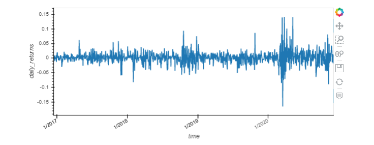

# Web_application

In recent years, finance has had an explosion in passive investing. Passive investing means that you invest in a basket of assets that’s called an exchange-traded fund (ETF). This way, you don’t spend time researching individual stocks or companies or take the risk of investing in a single stock. ETFs offer more diversification. I have build a financial database and web application by using SQL, Python, and the Voilà library to analyze the performance of a hypothetical fintech ETF.

